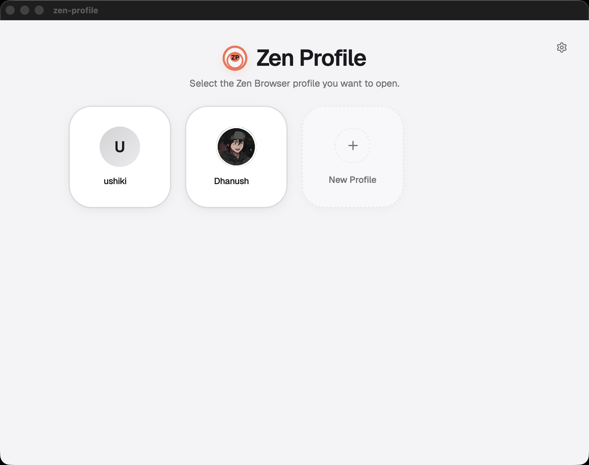
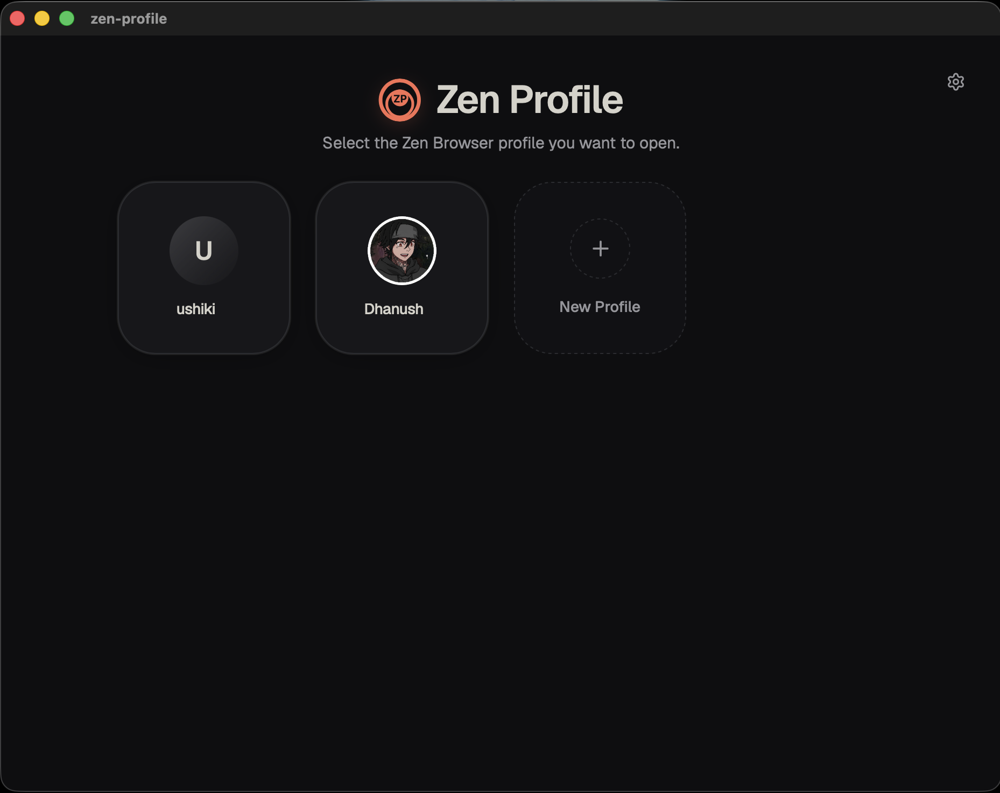
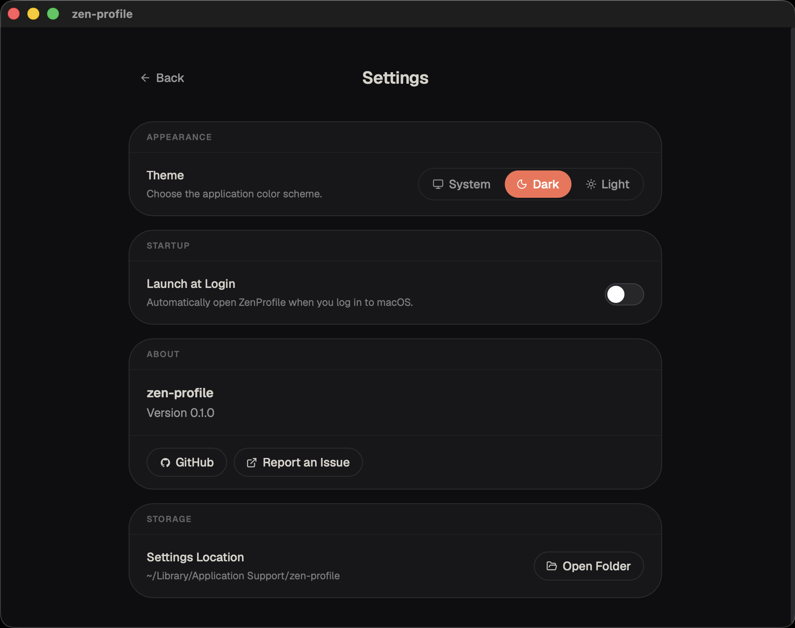
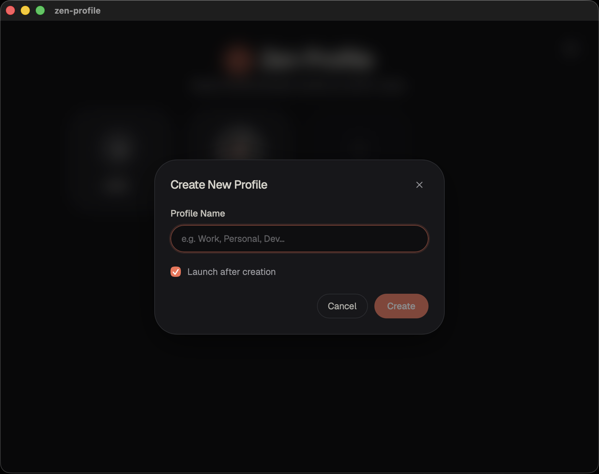

<div align="center">

# Zen Profile


### A modern native profile manager for Zen Browser on macOS.

Create, launch, rename and customize Zen Browser profiles from one beautiful native application.


</div>

---

# Screenshots

## Home

<p align="center">

</p>

<p align="center">

</p>
---

## Settings

<p align="center">

</p>

---

## Create Profile

<p align="center">

</p>

---

# Features

-  Launch Zen Browser profiles instantly
-  Create new profiles
-  Rename profiles
-  Custom profile avatars
-  Remove profile avatars
-  Light / Dark / System themes
-  Native Settings page
-  Native macOS shortcuts
-  Native macOS menu bar
-  Zen-inspired interface

---

# Installation

## Download

Download the latest release from the GitHub Releases page.

> **Releases**
>
> https://github.com/dhanush-devx/Zen-profile/releases

---

# Build From Source

## Requirements

- macOS
- Node.js 20+
- Rust
- Cargo
- Tauri CLI

Clone the repository

```bash
git clone https://github.com/dhanush-devx/Zen-profile.git

cd Zen-profile
```

Install dependencies

```bash
npm install
```

Run development mode

```bash
npm run tauri dev
```

Build production

```bash
npm run tauri build
```

---

# Keyboard Shortcuts

| Shortcut | Action |
|----------|--------|
| ⌘ N | New Profile |
| ⌘ , | Open Settings |
| Esc | Close dialog |
| Enter | Confirm action |

---

# Why Zen Profile?

Zen Browser already has excellent profile support, but creating and switching profiles requires opening the browser first anf go to settings.

Zen Profile provides a lightweight native macOS companion that lets you:

- launch profiles
- create profiles
- rename profiles
- personalize them with avatars

without opening Zen Browser first.

---

# Tech Stack

- Tauri v2
- Rust
- React
- TypeScript
- Tailwind CSS
- Lucide Icons

---

# Roadmap

## v0.1.0

- ✅ Launch profiles
- ✅ Create profiles
- ✅ Rename profiles
- ✅ Custom avatars
- ✅ Remove avatars
- ✅ Theme support
- ✅ Native Settings
- ✅ Keyboard shortcuts
- ✅ Native menu bar

## Future

- Windows support
- Linux support
- Automatic updates

---

# Contributing

Contributions, suggestions and bug reports are welcome.

Feel free to open an Issue or submit a Pull Request.

---

# License

MIT

---

<div align="center">

Made with ❤️ using Rust, Tauri and React.

</div>