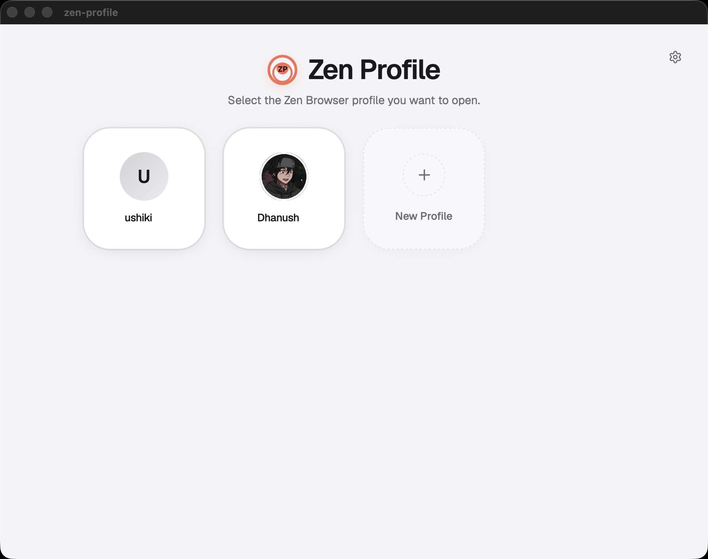
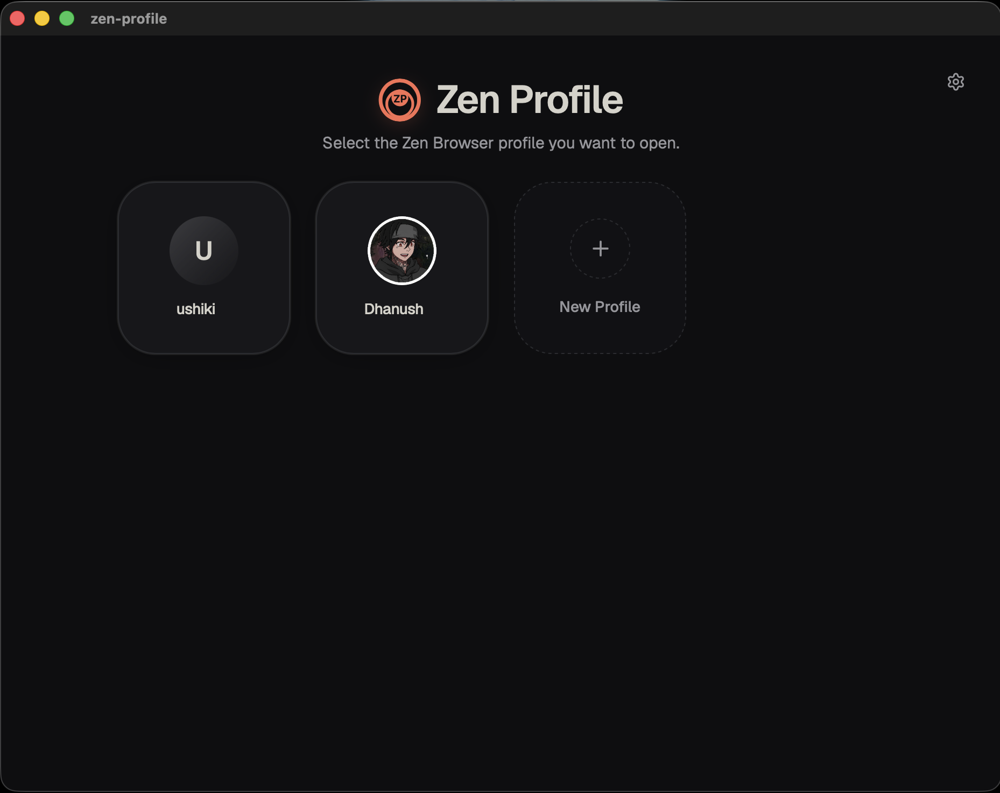
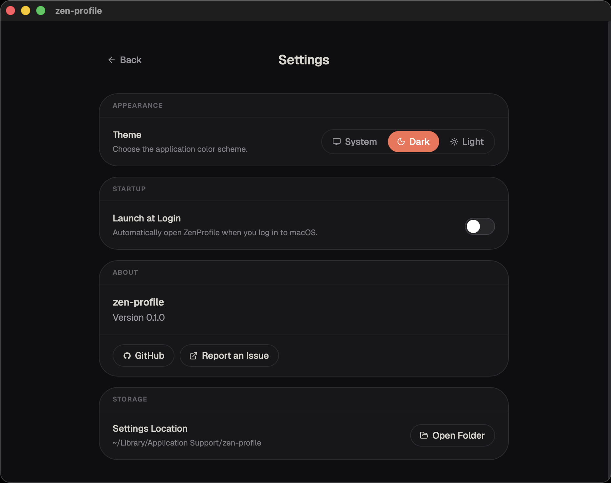
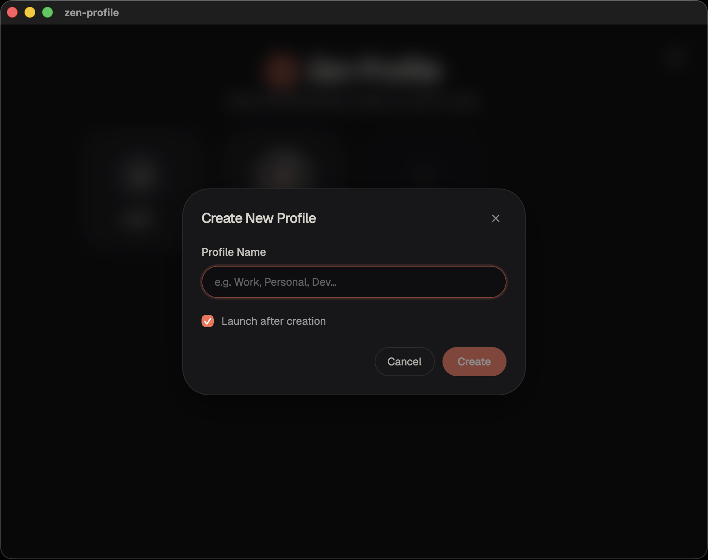

<div align="center">

# Zen Profile


### A modern native profile manager for Zen Browser.

Create, launch, rename, and customize Zen Browser profiles from one beautiful native desktop application.

[](https://github.com/dhanush-devx/Zen-profile/actions/workflows/ci.yml)
[](https://github.com/dhanush-devx/Zen-profile/actions/workflows/release.yml)


</div>

---

# Screenshots

## Home

<p align="center">

</p>

<p align="center">

</p>

---

## Settings

<p align="center">

</p>

---

## Create Profile

<p align="center">

</p>

---

# Features

- Launch Zen Browser profiles instantly
- Create new profiles
- Rename profiles
- Custom profile avatars
- Remove profile avatars
- Light, Dark, and System themes
- Native settings page
- Keyboard shortcuts
- Native desktop application
- Automatic profile discovery
- macOS support
- Windows support
- Linux support

---

# Downloads

Download the latest release for your platform.

### Supported Platforms

| Platform | Package |
|----------|---------|
| macOS | DMG |
| Windows | MSI |
| Linux | AppImage |

### Latest Release

https://github.com/dhanush-devx/Zen-profile/releases/latest

---

# Build From Source

## Requirements

- Node.js 20+
- Rust
- Cargo
- Tauri CLI

Clone the repository

```bash
git clone https://github.com/dhanush-devx/Zen-profile.git

cd Zen-profile
```

Install dependencies

```bash
npm install
```

Run development mode

```bash
npm run tauri dev
```

Build for your platform

```bash
npm run tauri build
```

---

# Keyboard Shortcuts

| Shortcut | Action |
|----------|--------|
| ⌘ N | Create Profile |
| ⌘ , | Open Settings |
| Esc | Close Dialog |
| Enter | Confirm Action |

---

# Why Zen Profile?

Zen Browser already includes profile support, but creating or switching profiles requires opening the browser and navigating through its settings.

Zen Profile is a lightweight native companion that lets you:

- Launch profiles instantly
- Create new profiles
- Rename existing profiles
- Personalize profiles with avatars

All without opening Zen Browser first.

---

# Tech Stack

- Tauri v2
- Rust
- React
- TypeScript
- Tailwind CSS
- Lucide Icons

---

# Roadmap

## ✅ v0.2.0

- Cross-platform support
  - macOS
  - Windows
  - Linux
- Launch profiles
- Create profiles
- Rename profiles
- Custom avatars
- Remove avatars
- Theme support
- Native settings
- Keyboard shortcuts
- Native menu bar
- GitHub Actions CI
- Automated Releases

## 🚧 Planned

- Automatic updates
- Custom Zen executable path
- System tray support
- Profile search
- Profile export/import
- Profile backup & restore

---

# Contributing

Contributions, feature requests, bug reports, and pull requests are always welcome.

If you have an idea to improve Zen Profile, feel free to open an issue or submit a pull request.

---

# License

This project is licensed under the MIT License.

---

<div align="center">

Built with ❤️ using Rust, Tauri, and React.

</div>